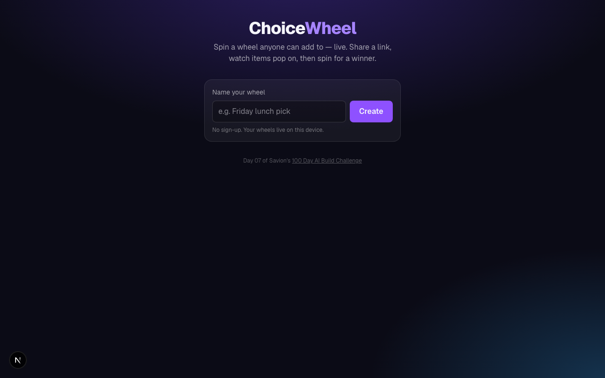

# ChoiceWheel

**Live:** https://choicewheel.100dayaichallenge.com

A crowd-sourced wheel spinner. Create a wheel, share a link, and let anyone add items to it **live** — each one slides onto the wheel with its own color in real time. When you spin, **every viewer watches the same wheel land** at once, with confetti and a winner reveal. The person who submitted the winning item gets a private prize-claim form. No sign-up.

Day 07 of Savion's [100 Day AI Build Challenge](https://www.100dayaichallenge.com/share/savion) — one app per day for 100 days.

## Screenshot



## Features

- **No login.** Creating a wheel makes you its owner via a secret link stored on your device. Make and delete as many wheels as you like.
- **Two roles, one link each.** The creator gets full control; guests get a share link that can only *view and submit* — never spin.
- **Live submissions.** Guest items appear on everyone's wheel instantly (Supabase Realtime), each with a rotating color. Names are optional and show as "Anonymous".
- **Draft / publish.** Build a wheel privately and seed it with your own items first; guests see "not live yet" until you publish.
- **Submission timer.** Optionally limit guest submissions to a countdown window (enforced server-side).
- **Synced spin.** One spin animates identically for every connected viewer, ending in a confetti winner overlay showing who submitted it.
- **👀 live "watching" count** via presence.
- **Winner prize claim.** Only the device that submitted the winning item gets a claim form — name, validated email, and a phone field with a country-flag dropdown and real per-country validation (stored as E.164). Claims land in the creator's panel.
- **Share with a QR code** for in-person use (parties, classrooms, streams).

## Stack

- [Next.js 16](https://nextjs.org/) (App Router) + React 19 + TypeScript
- [Tailwind CSS v4](https://tailwindcss.com/)
- [Supabase](https://supabase.com/) — Postgres, Row-Level Security, Realtime
- [canvas-confetti](https://github.com/catdad/canvas-confetti), [qrcode.react](https://github.com/zpao/qrcode.react), [react-phone-number-input](https://github.com/catamphetamine/react-phone-number-input)

There is no login: creator ownership is a secret `admin_token`, and every privileged action goes through a Postgres `SECURITY DEFINER` function that verifies it — so the app runs entirely on Supabase's publishable (client-safe) key, no service role needed.

## Install

```bash
git clone https://github.com/Still-InFrame/day-07-choicewheel.git
cd day-07-choicewheel
npm install
```

Set up Supabase:

1. Create a Supabase project and run [`supabase/schema.sql`](supabase/schema.sql) in its SQL editor (creates the tables, RLS policies, RPCs, and Realtime publication).
2. Create `.env.local`:

   ```bash
   NEXT_PUBLIC_SUPABASE_URL=your-project-url
   NEXT_PUBLIC_SUPABASE_PUBLISHABLE_KEY=your-publishable-key
   ```

Then run it:

```bash
npm run dev
```

Open http://localhost:3000.
